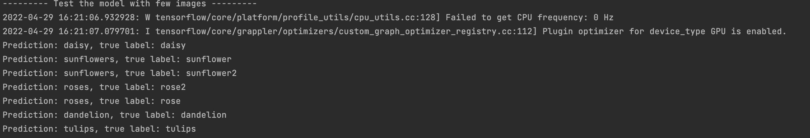
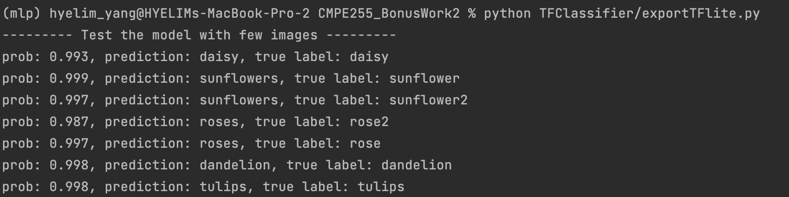
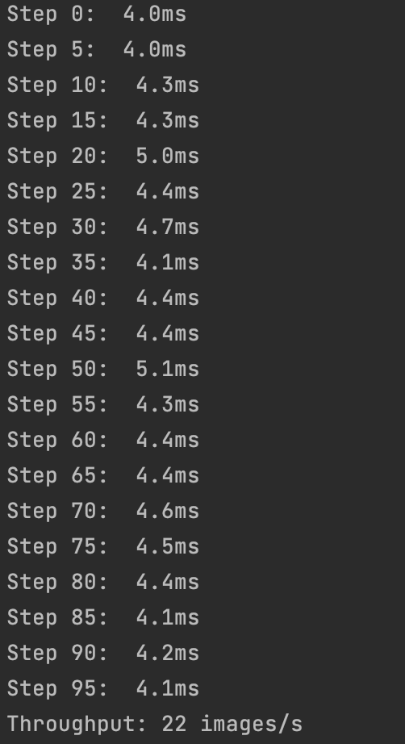
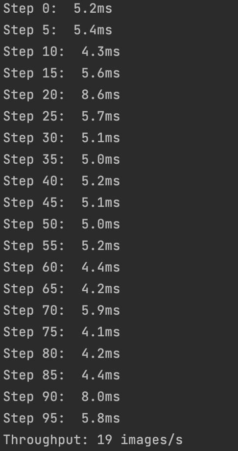
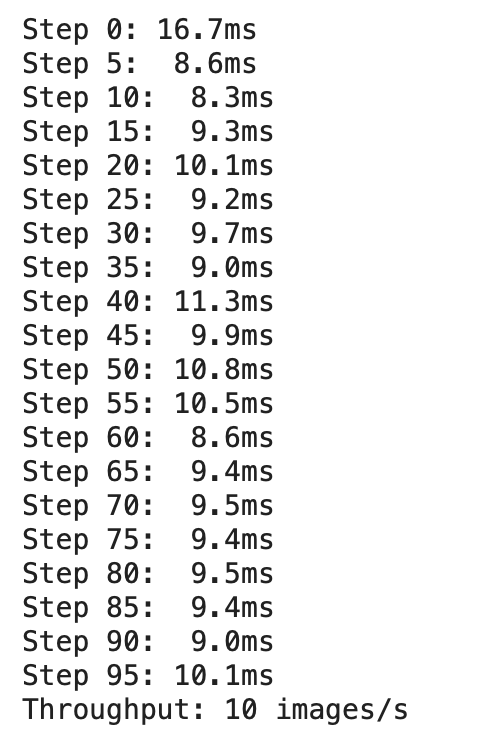

# CMPE 255 Bonus work 2 
## by Hyelim Yang (015957045)

## Data
Flower recognition data
- Download data by running [getflowertraintestdataset.py](DatasetTools/getflowertraintestdataset.py)
- Download data by running [getflowerdataset.py](DatasetTools/getflowerdataset.py) for future use of [generateTFrecordfile.py](DatasetTools/generateTFrecordfile.py)
- Generate TFrecord by running [generateTFrecordfile.py](DatasetTools/generateTFrecordfile.py)

## Create models
- Using [myTFDistributedTrainerv2.py](myTFDistributedTrainerv2.py), flower_xceptionmodel1_0712 model is created and then saved.
- Using [exportTFlite](\TFClassifier\exportTFlite.py) file in TFClassifier, TensorFlowLite model is created and then saved.

## Modified codes
- Using [exportTFlite](\TFClassifier\exportTFlite.py) file in TFClassifier, inference testing with TensorFlowLite model was performed in M1 Macbook.
- Using [myTFDistributedTrainerv2.py](myTFDistributedTrainerv2.py), inference testing with native TensorFlow model was performed in M1 Macbook.
- Using this [Colab](https://colab.research.google.com/drive/1wF2q4gNd_zMyg9j_HH2KlUWbAw8TgX9a?usp=sharing), inference testing with TensorFlow model was performed in Google Colab GPU

## Inference testing
- 7 images are used for benchmarking testing
- Initially 10 warm up runs were performed
- The average time was calculating by running 100 times

## Check if the model works
### TF model

### TFLite model

## Comparison result
### TF model running in M1 chip Macbook

### TFLite model running in M1 chip Macbook

### TF model running in Google Colab with GPU (NVIDIA-SMI)

As you can see the result, TF model running in M1 chip Macbook is the fastest with 28 images prediction per second. 
TFLite model running in M1 chip Macbook is the second highest with 22 images predictions per second 
and then TF model running in Google Colab with NVIDIA GPU shows the slowest speed, 10 images per second.
